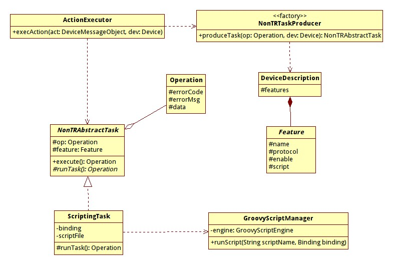

===================
Groovy Introduction
===================

--------------------------------------------
A Dynamic Language based on the JVM platform
--------------------------------------------

:Author: Jerry Peng <pr2jerry@gmail.com>

Powerful Platform, Old Language
===============================
- JVM is a powerful platform
    - Industry-standard
    - Performance
    - Security
    - Stability
    - Existing tools, libraries
- The Java language is really old
    - Lack of important features of modern languages
        - First-class functions, closure, etc.
    - Verbose
    - Slowly evolving
        - Java 7, 8

Alternative Languages on JVM
============================
- Groovy, Jython, JRuby
    - Dynamic language
- Scala
    - Static language
    - Actor model
    - Really complex
- Clojure
    - Lisp dialect with modern features
    - Macros, code as data, pure functional
    - Immutable data structure
    - Software transactional memory

Alternative Languages on JVM
============================
It is worth learning one or more of these languages.

- Think Different
    - OO vs Functional
    - Dynamic vs Static
- Use these languages in Java projects

Introduction to Groovy
======================
- Dynamic language
- First-class function and closure
- Easy to read and learn
    - Compatible with Java syntax
- DSL support

First Sight on Groovy
=====================
Hello world::

    class HelloWorld {
        
        static main(args) {
            println("Hello world");
            println "Hello world"
            def name = "WKS"
            println "Hello to ${name}"
        }
    }

First Sight on Groovy
=====================
- Parentheses are optional if there is only one argument
- Variable type is optional
- Groovy template

Install & Run
=============
- Need a JDK installed (JAVA_HOME, PATH)
- Configure GROOVY_HOME and PATH
- REPL(Read Evaluation Print Loop)
    - Groovy Shell (groovysh)
    - REPL is great for test/experiment/learning
- Run a groovy script::

    groovy xxx.groovy

- Install guide [1]_.

.. [1] http://groovy.codehaus.org/Installing+Groovy

A Brief Tour of Groovy Features
===============================
- Just an introduction
    - Still unfamiliar with Groovy
- Need to explore the language by yourself
    - Use groovy shell to do experiments
- Features to introduce:
    - Functional Programming
    - Regular expression
    - Groovy string template

Functional Programming
======================
- First-class function
    - Function is also a kind of object
    - Could be created on the fly
    - Function could be used as argument or return value
- Anonymous function (function without a name)
    - In Groovy, it is called Block
- Supports closure

Functional Programming
======================
Functions could be assigned to variables::

    groovy:000> add = {x, y -> x + y}
    ===> groovysh_evaluate$_run_closure1@1c19919
    groovy:000> add(10, 9)
    ===> 19
    groovy:000> square = {it * it}
    ===> groovysh_evaluate$_run_closure1@a166bd
    groovy:000> square(9)
    ===> 81

Functional Programming
======================
Functions could be passed as aruguments::

    groovy:000> [1, 2, 3, 4, 5].collect {it * 2}
    ===> [2, 4, 6, 8, 10]
    groovy:000> (1..20).findAll {it % 2 == 1}
    ===> [1, 3, 5, 7, 9, 11, 13, 15, 17, 19]
    groovy:000> ["OneMS", "SPU", "iSharing"].each {
        println it }
    OneMS
    SPU
    iSharing
    ===> [OneMS, SPU, iSharing]

Functional Programming
======================
- Collection class have methods that take function as arguments
    - find, findAll
    - collect, inject (map/reduce)
    - each

Closure
=======
- A enclosed function that binds its enclosing scope
- A means to bind data with function
- Like Java anonymous class
    - Could access final variables in outer scope from inside the method

Closure
=======
A example of closure::

    groovy:000> max = -1
    ===> -1
    groovy:000> [0, 99, 1, 56, 23].each {if (it > max)
        max = it;}
    ===> [0, 99, 1, 56, 23]
    groovy:000> max
    ===> 99

Why Functional Programming
==========================
- State is evil
    - FP encourge immutability and side-effect-free functions
    - State make concurrent programming harder
- Parallelization
- Lazy evaluation

Template Method Design Pattern with FP
=======================================
- Use FileInputStream as an example::

    FileInputStream stream = null;
    try {
        stream = new FileInputStream(fileName);
        // Do this, do that
    } catch( IOException e) {
        e.printStackTrace();
    } finally {
        if (stream != null) {
            try { stream.close();}
            catch (IOException e) {}
        }
    }

Template Method Design Pattern with FP
=======================================
- Want to do some refactorings? ::

    public interface FileStreamCallback {
        void doWithFileInputStream(FileInputStream in);
    }

    public void withFileInputStream(String fileName,
            FileStreamCallback callback) {
        FileInputStream stream = null;
        try {
            stream = new FileInputStream(fileName);
            callback.doWithFileInputStream(stream);
        } catch(...)
    } 

Template Method Design Pattern with FP
=======================================
- Anonymous inner classes are too ugly::

    public void test() {
        final String foo = "foo";
        withFileInputStream("foo.txt",
                new FileStreamCallback() {
            @Override
            public void doWithFileInputStream(
                FileInputStream in) {
                // foo = "bar";
                // Not possible since foo is final
                in.read()
            }
        });
    }

How to Do This with FP
======================
- Implement the same method in Groovy with closures::

    def withFileInputStream(fileName, func) {
        def stream = null;
        try {
            stream = new FileInputStream(fileName)
            func(stream)
        } catch(...)
    }

How to Do This with FP
======================
- Anonymous functions looks much better ::

    static def testIt() {
        def foo = "foo"
        withFileInputStream("foo.txt") {
            foo = "bar"
            it.read()
            //Do this, do that
        }
    }

Sum It Up
=========
- It is easy to write quite readable code with FP
- Since closures bind to scope, what you can do is not limited
- No need to use final

Regular Expression
==================
- It's easy to use regular expressions in Groovy
- The ==~ and =~ operator
    - ==~ return true/false (match or not)
    - =~ returns the matcher object
- Surround regular expression with "/"
    - Easy to read
    - No need to escape
- Easy group capturing
    - Access groups via array index
    - Two dimensinal array

Regular Expression
==================
Examples::

    groovy:000> "
hello
" ==~ /<(\w+)>(.*)<\/\1>/
    ===> true
    groovy:000> "
hello</a>" ==~ /<(\w+)>(.*)<\/\1>/
    ===> false
    groovy:000> matcher = ("
hello
" =~ /<(\w+)>(.*)<\/\1>/)
    ===> java.util.regex.Matcher[pattern=<(\w+)>(.*)</\1> region=0,12 lastmatch=]
    groovy:000> matcher[0]
    ===> [
hello
, p, hello]
    groovy:000> matcher[0][1]
    ===> p
    groovy:000> matcher[0][2]
    ===> hello

Groovy Template
===============
- Two kinds of strings in Groovy
    - Simple string, the same as Java strings
    - Groovy string, which supports template::

        groovy:000> num = 123
        ===> 123
        groovy:000> 'value is ${num}'
        ===> value is ${num}
        groovy:000> "value is ${num}"
        ===> value is 123

Groovy Template
===============
- Like JSP, freemarker, etc.
- Refer to official intro doc [2]_.

.. [2] http://groovy.codehaus.org/Groovy+Templates

Using Groovy (Standalone)
=========================
- Groovy code could be compiled to regular class files
- Automates the process with ant tasks
- Web development
    - Grails

Using Groovy (Embedded)
=======================
- Benefit from the power of dynamic languages in legacy projects
- Three methods to embed Groovy into Java projects:
    - Groovy Shell
    - Groovy Class Loader
    - Groovy Script Engine

Groovy Shell
============
- Evaluate Groovy expressions or run scripts
- Pass in/out variables via Bindings
- Could set the base class of the scripts (so they could share common methods, etc.)

Groovy Shell
============
Example::

    // call groovy expressions from Java code
    Binding binding = new Binding();
    binding.setVariable("foo",
        new Integer(2));
    GroovyShell shell = new GroovyShell(binding);

    Object value = shell.evaluate(
        "println 'Hello World!'; x = 123; return foo * 10"
        );
    assert value.equals(new Integer(20));
    assert binding.getVariable("x")
        .equals(new Integer(123));

Groovy Class Loader
===================
- Use Groovy Class Loader to load scripts or Groovy classes
    - Simple scripts are subclasses of Script
- Use parseClass method to compile Groovy scripts/classes
- Then use the Class object to initiate objects and invoke their methods
- Useful in scenarios where all Groovy classes implements common interfaces
- If loadClass is used (to support hot reloading), PermGen memory issue may be a problem

Groovy Class Loader
===================
Example(from Nawras project)::

    file = FileUtil.loadClassPathFile(
        String.format("%s/%s",
            SCRIPT_ROOT_DIR,
            filename)
        );
    String clsName = "data.scripts." + 
        filename.replaceAll("\\.groovy", ""); 
    clazz = classLoader.loadClass(clsName,
                                  true,
                                  false);
    this.scriptTask = clazz.getConstructor(Binding.class)
                        .newInstance(binding);

Groovy Script Engine
====================
- Most powerful solution
- Supports hot reloading
- Track dependencies automatically
- No PermGen memory issue
- Provides a CLASSPATH of all the groovy scripts/classes

Groovy Script Engine
====================
Example(from Nawras project)::

    engine = new GroovyScriptEngine(new URL[] {
        getClass()
        .getClassLoader()
        .getResource(SCRIPT_ROOT_DIR)
        });
    engine.run(scriptName, binding);

Nawras Project Case Study
=========================
- Non-TR protocol stack
    - Manage devices via telnet
- Not standard protocol
- Need to implement tasks for different device type
    - Different device models have different telnet interfaces
- Two much work to modify both NBI/GUI and SBI
- Keep NBI/GUI features unmodified, implement new SBI stack

Nawras Project Case Study
=========================
- Use Groovy script to implement tasks
    - Task logic may always change
    - New device models may need new scripts
    - Need hot reloading

Nawras Project Case Study
=========================

Nawras Project Case Study
=========================
- Script names are written in DD::

    <feature name="IPPING" 
        support="true"
        script="telnet_deviceping.groovy" 
        protocol="telnet"/>
    <feature name="WAN" 
        support="true" 
        script="telnet_config_ipaddr.groovy" 
        protocol="telnet"/>

Nawras Project Case Study
=========================
- Refer to Nawras Non-TR DS for the detailed design

Groovy resources
================
- Functional Programming with Groovy [3]_.
- Functional Thinking [4]_.

.. [3] http://www.slideshare.net/arturoherrero/functional-programming-with-groovy
.. [4] http://www.ibm.com/developerworks/cn/views/java/libraryview.jsp?view_by=search&sort_by=Date&sort_order=desc&view_by=Search&search_by=%E5%87%BD%E6%95%B0%E5%BC%8F%E6%80%9D%E7%BB%B4&dwsearch.x=18&dwsearch.y=11

Happy Hacking
=============

