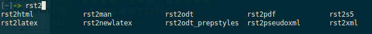

.. include:: <s5defs.txt>

======================
可爱的reStructuredText
======================

----------------------------
实用主义者的文档解决方案
----------------------------

:Author: Jerry Peng <pr2jerry@gmail.com>


用什么写文档？
==============
* WYSIWYG字处理工具
    * M$ Word
    * OpenOffice Writer
* 纯文本的文档格式
    * XML类标记语言（Docbook, HTML）
    * LaTeX
    * 轻量级标记语言
* Embedded in Code


WYSIWYG字处理软件
=================
* What You See Is What You Get
    * Not always true
* 大量的鼠标点击
* 繁复的格式调整
* 二进制的文件格式
    * 无法diff，不利于作版本控制


WYSIWYG字处理软件
=================
* 花架子功能，影响心情（个人对此深恶痛绝）
    * 首字母自动大写
    * 自动识别为日期
    * 电脑软件是不应该“自作聪明”的
        * 用户知道自己要干什么，你一机器指手画脚干嘛！
* 总而言之，无法让人集中于主要问题上
    * 让人流畅地将idea变成文档才是最重要的


LaTeX
=====
* 学习曲线让人望而却步
    * 投入／回报不成比例
* 工具链复杂
    * 宏包
    * 中文问题

LaTeX
=====
* 适合产出印刷物，学术论文
* 不适合日常的工作文档，项目文档
    * 效率不高
* 没玩过LaTeX，所以轻拍…… ;-)
    * 期待TJLUG的LaTeX用户分享一下经验，让我入个门


XML/HTML
========
* 没人直接用HTML写文档吧？
    * 但HTML是常见的输出格式
* XML文档解决方案——Docbook
    * 一切都满足需求
    * 但它是坑爹的XML！
        * 标签要闭合
        * 源文件可读性不好


轻量级标记语言
==============
* Markdown
* Vimwiki
* reStructuredText
    * 今天的主角
    * 下面简称ReST


代码中嵌入文档
==============
* 只适合API文档
* 方便和代码保持同步
* 通过工具生成


实用主义者的标准
================
* 必须是纯文本
    * 可以用最趁手的编辑器，比如：Vim
    * 轻松做版本控制
* 数据和表现分离
    * 文档源文件只包含结构化的数据
    * 以样式表、主题或者命令行选项的方式来控制字体、颜色等
    * 同样的源文件结合不同的样式得到不同的展现


实用主义者的标准
================
* 源文件的可读性要好
    * HTML/XML第一个被排除掉
* 可以输出到多种格式
    * HTML, pdf是必须的
    * S5——这样就可以做slides了
    * LaTeX——可以做进一步排版，方便打印或者输出高质量的pdf
* 易学易用，上手快，编辑效率高
    * 所以排除了LaTeX


主角登场：ReST
==========================
* Powered by Python Technology
    * python-docutils
* 基于StructuredText和Setext标记语言强化而来
* 源文件可读性很好
* 保持简单的同时功能强大
* 可以输出为多种格式
    


安装python-docutils
===================
* 通过发行版的包管理器直接安装::

    sudo apt-get install python-docutils
    sudo apt-get install rst2pdf

* 通过Python pip来安装::

    sudo pip install docutils
    sudo pip install rst2pdf

* 建议用pip + virtualenv来管理Python包


ReST格式简介
========================
* 很多格式与Markdown等其他轻量标记语言类似
* 符合直觉，很容易记忆
* 这里简要介绍，详细的文档请Google之
    * ReST官网 [1]_.
    * Quick ReST [2]_.

.. [1] http://docutils.sourceforge.net/rst.html
.. [2] http://docutils.sourceforge.net/docs/user/rst/quickref.html


标题
====
* 标题的格式::

    ========
    文档标题
    ========

    ----------
    文档副标题
    ----------

* 文档标题和副标题通常用在封面页


标题
====
* 标题的格式::

    一级标题
    ========

    二级标题
    --------

    三级标题
    ````````

* 这些是文档各节（section）的标题
* 文档的目录根据这些标题生成


标题
====
* 可以使用字母数字以外的可打印ACSII字符，官方推荐的是以下字符::

    Recommended choices are 
    "``= - ` : ' " ~ ^ _ * + # < >``"

* 标题前后的符号数目必须大于等于标题文本的长度


段落
====
* 段落的格式::

    段落不需要特殊标记，用空行来分割，
    段落内的换行是被忽略的，因此源文件
    可以很好地控制一行的长度。

    这是一段。

    这是第二段。

        段落可以缩进，通常用来表达引用的文字。


段落
====
段落不需要特殊标记，用空行来分割，
段落内的换行是被忽略的，因此源文件
可以很好地控制一行的长度。

这是一段。

这是第二段。

    段落可以缩进，通常用来表达引用的文字。


行内标记
========
* 用来实现斜体、粗体、引用、脚注、引用等等::

    *斜体*, **粗体**, hyperlink_, 脚注 [3]_

    .. [3] 脚注的正文
    .. _hyperlink:  http://jerrypeng.me

* 还有更多其他标记，请参考文档


行内标记
========
*斜体*, **粗体**, hyperlink_, 脚注 [3]_

.. [3] 脚注的正文
.. _hyperlink:  http://jerrypeng.me


项目编号
========
* 项目符号的格式::

    前面的段落，下面需要一个空行。

    - 项目一
    - 项目二
    - 项目符号后必须跟一个空格
    - 一组项目的前后要加上空行
    - 可以用*, -, +来作为bullet，如果有多行，
      必须和上一行的文字对其，像你看到的这样。

    后面的段落，上面需要一个空行。


项目编号
========
前面的段落，下面需要一个空行。

- 项目一
- 项目二
- 项目符号后必须跟一个空格
- 一组项目的前后要加上空行
- 可以用*, -, +来作为bullet，如果有多行，
  必须和上一行的文字对其，像你看到的这样。

后面的段落，上面需要一个空行。


数字编号
========
* 数字编号的格式::
    
    规则和项目编号一样，只不过用数字来替代项目符号

    1. 第一项
    2. 第二项
    3. 格式是数字后面跟一个'.'，再跟一个空格
    #. 用#替代数字来自动编号


数字编号
========
规则和项目编号一样，只不过用数字来替代项目符号

1. 第一项
2. 第二项
3. 格式是数字后面跟一个'.'，再跟一个空格
#. 用#替代数字来自动编号


表格
====
* 表格的格式::

    +------------+------------+-----------+ 
    | Header 1   | Header 2   | Header 3  | 
    +============+============+===========+ 
    | body row 1 | column 2   | column 3  | 
    +------------+------------+-----------+ 
    | body row 2 | Cells may span columns.| 
    +------------+------------+-----------+ 
    | body row 3 | Cells may  | - Cells   | 
    +------------+ span rows. | - contain | 
    | body row 4 |            | - blocks. | 
    +------------+------------+-----------+


表格
====
* 效果:

    +------------+------------+-----------+ 
    | Header 1   | Header 2   | Header 3  | 
    +============+============+===========+ 
    | body row 1 | column 2   | column 3  | 
    +------------+------------+-----------+ 
    | body row 2 | Cells may span columns.| 
    +------------+------------+-----------+ 
    | body row 3 | Cells may  | - Cells   | 
    +------------+ span rows. | - contain | 
    | body row 4 |            | - blocks. | 
    +------------+------------+-----------+


简单表格
========
* 简单表格的格式::

    =====  =====  ====== 
       Inputs     Output 
    ------------  ------ 
      A      B    A or B 
    =====  =====  ====== 
    False  False  False 
    True   False  True 
    False  True   True 
    True   True   True 
    =====  =====  ======


简单表格
========
* 效果:

    =====  =====  ====== 
       Inputs     Output 
    ------------  ------ 
      A      B    A or B 
    =====  =====  ====== 
    False  False  False 
    True   False  True 
    False  True   True 
    True   True   True 
    =====  =====  ======


指令（Directives）
==================
* 指令是基本的标记之外的扩展机制
* 有一组标准的指令
    * 目录
    * 图片，内嵌代码
    * 公式
    * 标准指令大全 [4]_
* 不同的工具可以实现自己独特的指令以实现高级功能

.. [4] http://docutils.sourceforge.net/docs/ref/rst/directives.html


指令的格式
==========
* 指令的格式如下::

    .. directive_type :: directive
       block


指令示例: 嵌入图片
==================
* 嵌入图片::

    .. image:: funny.gif
       :height: 100px
       :width: 100px
       :alt: funny cat picture
       :align: center

.. image:: funny.gif
   :height: 100px
   :width: 100px
   :alt: funny cat picture
   :align: center


指令实例: 嵌入代码
==================
* 嵌入代码::

    .. code:: python

        def say_hello():
            print 'Hello, ReST'

        if __name__ == '__main__':
            say_hello()


* docutils-0.9才开始支持，无法演示了……
* sphinx和rst2pdf支持code-block这个指令
    * 用法和上面的一致，把code改成code-block即可


Enough for Now
==============
* 先介绍这么多
* 使用时现查手册就足够了
* 很容易记忆


ReST工具链
==========
* 核心工具包python-docutils
    * 提供HTML, OpenOffice, S5, TeX等的转换工具
* rst2pdf
    * 基于python-reportlib
    * 简单，够用
    * 中文支持不完善
* sphinx
    * 支持HTML, LaTeX, man输出
    * 可以创建更漂亮，更完善的文档
    * 交叉引用, 自动索引


ReST的Slides解决方案
====================
* 输出S5 XHTML Slides::

    rst2s5 --theme small-white rest-intro.rst index.html
    rst2s5 --theme-url ui/pixel rest-intro.rst index.html

--theme
    使用rst2s5内置的主题 [5]_., 相关文件会被拷贝到HTML所在的目录
--theme-url
    使用指定的主题，仅作链接

* landslide可以输出HTML5的slides
    * 请向连长同志请教

.. [5] /usr/lib/pymodules/python2.7/docutils/writers/s5_html/themes


Everybody Loves PDF!
====================
* 相信大家都比较喜欢PDF格式的文档
    * 美观，便于阅读和传播
    * 天生适合打印
* 个人选择ReST的初衷
    * 产出PDF格式的设计文档


PDF解决方案
===========
* 简单的方案
    * rst2pdf
* 复杂，但更强大的方案
    * sphinx + texlive
    * 绝对值得折腾！


rst2pdf
=======
* 基本使用方法::

    rst2pdf test.rst
    rst2pdf -s chinese.style test.rst

* 支持自定义样式表
    * 指定字体（解决中文就靠它了！）
    * 更多高级用法请参考文档 [7]_.

.. [7] http://code.google.com/p/rst2pdf/


rst2pdf中文问题
===============
* 默认字体不支持中文
    * 所以直接转换出来必定是乱码
* 附加自定义样式表来改变默认字体
* 指定换行规则用中文规则


rst2pdf中文问题
===============
* 写一个自定义的样式表::

    {
    "styles": {
        "base": {
            "wordWrap": "CJK"
            }
        },
    "embeddedFonts" : [["simfang.ttf", "simhei.ttf",
                        "simkai.ttf",  "simsun.ttc"]],
    "fontsAlias" : {
        "stdFont": "simsun",
        "stdBold": "simhei",
        "stdItalic": "simkai"
        }
    }


rst2pdf中文问题
===============
* 用-s选项来用应用指定的样式表::

    rst2pdf -s chinese.style test.rst

* 很不幸，用最新的rst2pdf和reportlib还是会出问题
    * 去掉styles部分关于wordWrap的设置可以正常输出PDF
    * 中文断行会有问题
    * 期待新版本能解决问题


更完美的PDF方案: shpinx + texlive
=================================
* 不够轻量, 但够强大
* texlive最近版本的中文支持已经很好了
* 适合大型文档，书籍等
* 个人感觉更加美观（错觉？心理作用？）


Sphinx
======
* Again, powered by Python
* 最初是为Python文档而诞生

.. image:: pydoc.png
   :align: center


安装和基本使用
==============
* 安装(再次推荐用virtualenv管理Python包)::

    sudo pip install sphinx

* 快速开始::

    mkdir mydoc && cd mydoc
    sphinx-quickstart

* 简单的向导，大部分选默认值即可
* 会产生配置文件conf.py以及Makefile
* 用make来产生目标格式的文档


用Sphinx输出中文PDF
===================
* 关于texlive
    * 最新的texlive 2011对中文的支持非常给力
    * 装好就可以直接使用，无需配置
    * 推荐用官方安装包，源里的貌似有问题


用Sphinx输出中文PDF
===================
* texlive 2011比较简单的支持中文的方式如下：
    1. 使用\\documentclass{ctexart}
    2. 使用\\usepackage{xeCJK}并用\\setCJKmainfont等设置字体
* sphinx已经定义了自己的documentclass，所以第一个方法行不通
    * ctexart默认使用Windows字体，在Linux也会有点麻烦
* 关于texlive的安装和基本使用，请Google之
    * 找最新版本的安装说明
    * 老版本的一些配置在新版本里可能完全不需要


用Sphinx输出中文PDF
===================
* 修改conf.py, 让它在生成的TeX文件中增加指定的头::

    latex_elements = {
    ...
    # Additional stuff for the LaTeX preamble.
    'preamble': '''
    \usepackage{xeCJK}
    \setCJKmainfont[BoldFont=Droid Sans Fallback, ItalicFont=AR PL UKai CN]{AR PL UMing CN}
    \setCJKmonofont[Scale=0.9]{AR PL UKai CN}
    \setCJKfamilyfont{song}[BoldFont=Droid Sans Fallback]{AR PL UMing CN}
    \setCJKfamilyfont{sf}[BoldFont=Droid Sans Fallback]{Droid Sans Fallback}
    ''',
    }


用Sphinx输出中文PDF
===================
* 用下面的命令来输出PDF文档::

    make latex
    cd _build/latex && xelatex mydoc.tex

* 不要使用sphinx提供的make latexpdf，其设计没有考虑中文，似乎不工作
* conf.py里还有更多可以改变的选项，比如documentclass可以选howto或者manual
    * howto很简洁，适合只有几页十几页的使用说明等
    * manual更适合长篇幅的大型文档或者书籍


个人的选择
==========
* HTML笔记：Vimwiki + github pages
    * 简单，够用
* HTML文档：sphinx
* PDF文档：一律用sphinx + texlive 2011


Happy Hacking!
==============
.. image:: q.jpg
   :align: center

